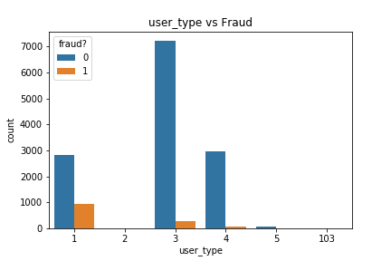

<!--  -->

# Fraud Case Study

## Table of Contents

- [Overview](#overview)
- [Data Preparation](#data-preparation)
    - [EDA](#eda)
- [Models](#models)
- [Summary](#summary)
- [Notes](#notes)
- [Future Work](#future-work)

## Overview

## Data Preparation

  

    <b> Dataset </b>  
  

### EDA

Fraudelent categories

   Channels vs Fraud       |  Delivery Method vs Fraud |     Gross Profits vs Fraud
:-------------------------:|:-------------------------:|:-------------------------:
 |   |    

   FB Published vs Fraud   |  Ticket Length vs Fraud   |     User Type vs Fraud
:-------------------------:|:-------------------------:|:-------------------------:
|   |    

   Sale Duration vs Fraud  |  Gmail vs Fraud           |     Previous Payout vs Fraud
:-------------------------:|:-------------------------:|:-------------------------:
|   |    

<!--  -->

## Models

    
Logistic Regression

<!--      -->

   

    
Random Forest Classifier

<!--      -->

    
XGBoost

<!--      -->

    
Gradient Boosting

<!--      -->

## Summary

## Notes

## Future Work

- [ ] KNN
- [ ] Better Model
- [ ] Clean up files